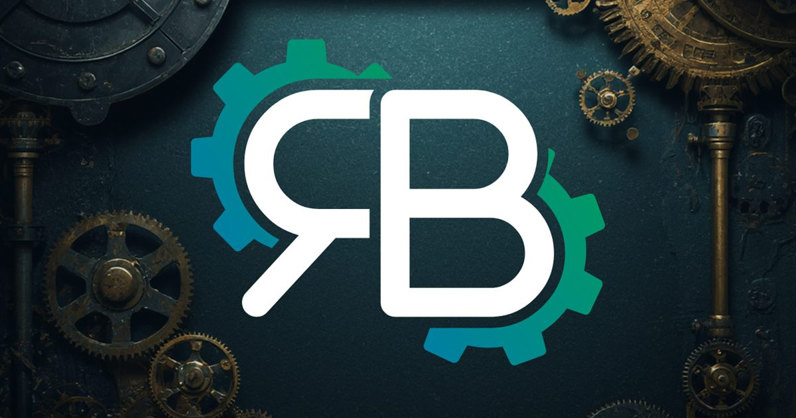

# Portfolio — Raphaël Bonacina

[](https://github.com/Gaby-code42/portfolio/actions/workflows/ci.yml)

Portfolio personnel de Raphaël Bonacina, développeur web front-end.
L'interface reprend les codes du jeu vidéo : thème terminal / cyber, et un
système de progression qui se remplit à mesure que le visiteur explore le site.

**🔗 [Voir le site en ligne](https://gaby-code42.github.io/portfolio/)**



## Le concept

Chaque page visitée fait progresser une barre de « scan » affichée en haut de
l'écran. Une fois les trois pages parcourues, une modale « MISSION COMPLETE »
apparaît et propose le CV en téléchargement. L'idée : transformer la visite
d'un portfolio — un exercice généralement passif — en quelque chose qu'on a
envie de terminer.

La logique vit dans un contexte React (`src/components/Provider`) qui écoute la
navigation et, pour les pages qui l'exigent, le pourcentage de scroll.

## Stack

| | |
|---|---|
| Framework | React 18 |
| Routing | React Router 6 |
| Styles | SCSS (7-1 allégé, un fichier par composant) |
| Animations | Framer Motion |
| Icônes | Font Awesome |
| Méta / SEO | react-helmet-async |
| Build | Create React App |
| Hébergement | GitHub Pages |

## Installation

```bash
git clone https://github.com/Gaby-code42/portfolio.git
cd portfolio
npm install
npm start
```

Le site est alors disponible sur http://localhost:3000.

## Scripts

| Commande | Effet |
|---|---|
| `npm start` | Serveur de développement |
| `npm run build` | Build de production dans `build/` |
| `npm test` | Lance les tests |
| `npm run deploy` | Build, génère le `404.html` puis publie sur GitHub Pages (manuel) |

> `npm run deploy` déclenche automatiquement `predeploy`, qui copie
> `index.html` en `404.html`. GitHub Pages ne connaît pas les routes côté
> client : sans ce fichier, un accès direct à `/realisation` renverrait une 404.

## Structure

```
src/
├── assets/          # Logo, fonds, CV
├── components/      # Composants réutilisables (un dossier = un composant + son SCSS)
│   ├── CongratPopUP/   # Modale de fin d'exploration
│   ├── Footer/
│   ├── Header/
│   ├── MenuBurger/     # Menu mobile façon terminal
│   ├── ProgressBar/    # Barre de progression « scan »
│   ├── Provider/       # Contexte de progression
│   └── SocialLinks/
├── data/            # index.json — les projets, hors du JSX
├── hooks/           # useBodyClass — fond de page selon la route
├── pages/           # Home, Realisation, About
└── styleGlobal/     # Styles globaux et utilitaires
```

## Ajouter un projet

Tout se passe dans `src/data/index.json` :

```json
{
  "id": 6,
  "title": "Nom du projet",
  "icon": "faReact",
  "shortdescription": "Une phrase qui décrit le projet.",
  "tags": ["React", "SCSS"],
  "github": "https://github.com/…",
  "demo": "https://…"
}
```

`icon` accepte `faHtml5`, `faJs`, `faReact`, `faNode` ou `faGlobe`.
`demo` peut valoir `null` : la carte affiche alors « Pas de démo ».

## Licence

Code sous licence MIT. Les contenus personnels (photo, CV, textes) restent la
propriété de leur auteur.
